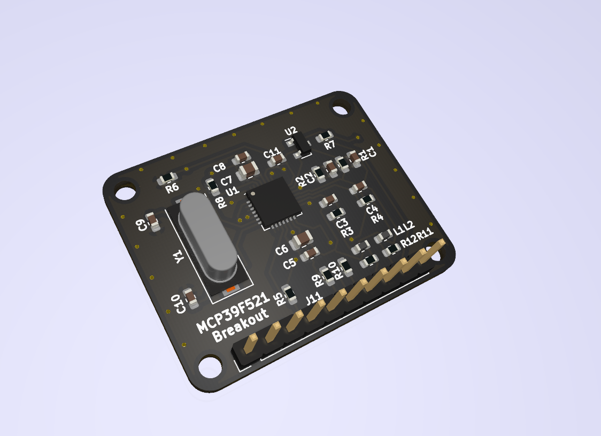
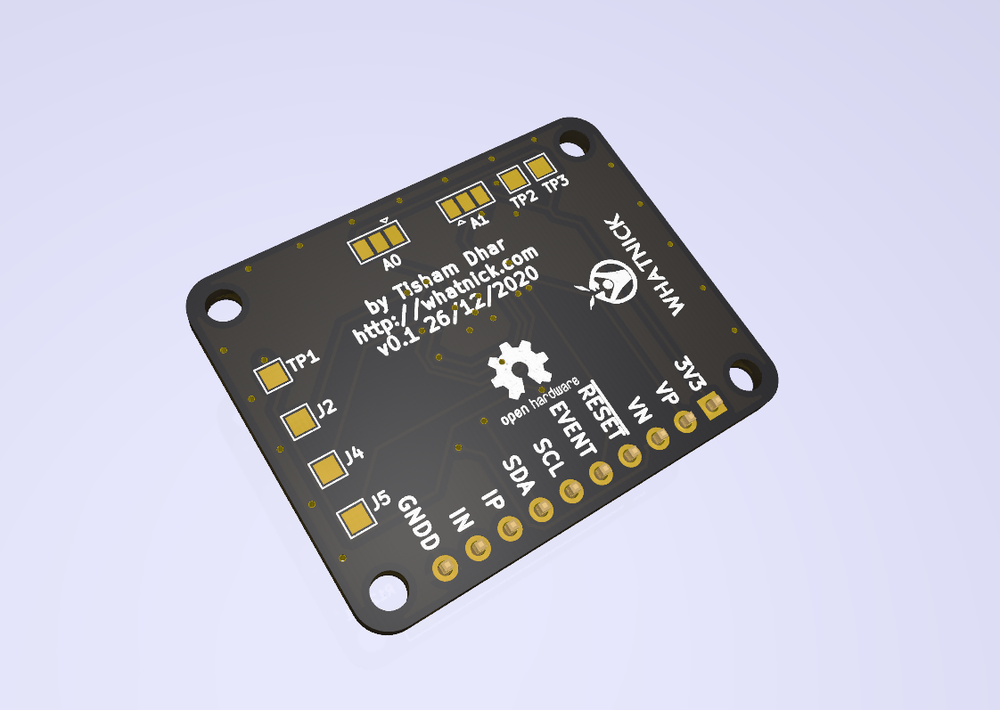

# MCP39F521 Breakout PCB

This is a basic breakout PCB for the [MCP39F521](https://www.microchip.com/wwwproducts/en/MCP39F521)
ASIC from Microchip. This ASIC has ADC's and an embedded PIC microcontroller to perform high-accuracy
energy measurements. The ASIC can appear in upto 4 i2c addresses based on jumper settings. The breakout
board is usable with this [Arduino Library](https://github.com/upbeatlabs/drwattson/tree/master/Arduino/UpbeatLabs_MCP39F521)

## PCB Design

## PCB Availabilty

- [Tindie]()
- [PCBWay]()
- [Aisler]()
- [OSHPark]()